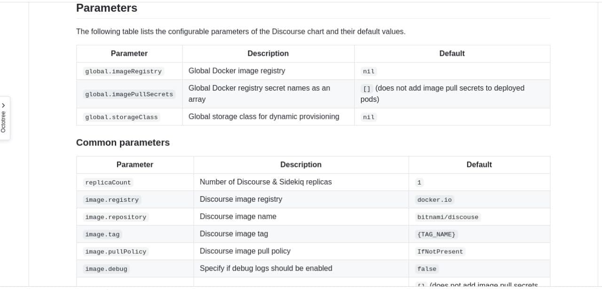

- [Introduction](#Introduction)
- [Installing Charts](#Installing-Charts)
- [Development Guide](#Development-Guide)
  - [Important Notes](#Important-Notes)
  - [Configuring Chart Pods](#Configuring-Chart-Pods)
  - [Ingress Configuration](#Ingress-Configuration)
  - [Resources Limits](#Resources-Limits)
  - [Adding Labels](#Adding-Labels)
  - [Enable Https](#Adding-Labels)
  - [Chart README](#Chart-README)
  - [Adding Chart](#Adding-Chart)
  - [Packaging](#Packaging)

# Introduction
This repo is used to maintain helm charts used as solution in `VDC marketplace` product.
## Installing Charts

-   Adding the repo to your helm 

    ```bash
    helm repo add marketplace https://threefoldtech.github.io/vdc-solutions-charts/
    ```
-   install a chart 

    ```bash
    helm install marketplace/<chart-name>
    ```

# Development Guide
## Important Notes
Charts in this repo will be used `VDC marketplace` and it will be used behind `Traefik` as a load balancer, so make sure if you are adding a chart to follow the exact steps in this development guide. And also make sure no manual interaction is required to deploy your chart

## Configuring Chart Pods
When initializing the chart, values can be set (using --set var=val or additional yaml file) to override `values.yaml` to configure different pods (this is handled by the chart chatflow).
There're different approaches as to how to use these values for configuration. Here are a few suggestions:
1. An init container can be used within the pod with shared volume to the to-be-configured container. 
The configuration can be done using a shared volume between the containers in the places where the values are set.
use these values.
2. Extend the image to receive the configuration as environment variable and add an entrypoint to use these variables to configure and start the node.
3. Secrets and ConfigMaps can be used as templates with values from `values.yaml` and its content can be used to override specific files or dirs in the container or be received as environment variables.
- for more information refer to this [link](https://helm.sh/docs/chart_template_guide/accessing_files/#configmap-and-secrets-utility-functions)


## Ingress Configuration
Traefik is used as the ingress controller. To expose a service outside the cluster, an ingress resource with the appropriate kind should be added. By default, the `ingress` kind is attached to web and websecure entrypoints, which means that it receives the http and https traffic when the request host matches the host in the ingress definition.

_Example_:
```yaml
kind: Ingress
apiVersion: networking.k8s.io/v1beta1
metadata:
  name: chartname-new-ingress
spec:
  rules:
    - host: example.com
      http:
        paths:
          - path: /
            backend:
              serviceName: whoami
              servicePort: 80
```

If you want to expose a service on ports other than 443 and 80. The steps to follow varies depending on the protocol of the service you want to expose. In all cases you have to create a new entrypoint in traefik in the corresponding chatflow with the command `self.vdc.get_deployer().kubernetes.add_traefik_entrypoint("chartname-newname", "8080")`. To avoid conflicts, please qualify the entrypoint with the chart name. So use `peertube-newentrypoint` instead of `newentrypoint`.

### HTTP service (on a port other than 80)
Create an ingress resource with the annotation `traefik.ingress.kubernetes.io/router.entrypoints: chartname-newname`. Using the ingress resource gives the flexibilty to receive only the requests for a specific host compared to tcp ingress.

_Example_:
```yaml
kind: Ingress
apiVersion: networking.k8s.io/v1beta1
metadata:
  name: chartname-new-ingress
  annotations:
    traefik.ingress.kubernetes.io/router.entrypoints: chartname-newname

spec:
  rules:
    - host: example.com
      http:
        paths:
          - path: /
            backend:
              serviceName: whoami
              servicePort: 80
```
### HTTPS service (on a port other than 443)
To expose an https service, please use the `IngressRouteTCP` traefik resource with the new entrypoint specified in the resource definition. You can also specify the hosts you want to receive the traffic for. If you want to receive for all requests, use HostSNI(`*`) as the match rule instead.

_Example_:
```yaml
apiVersion: traefik.containo.us/v1alpha1
kind: IngressRouteTCP
metadata:
  name: chats-newhttps-ingress
spec:
  entryPoints:
    - chartname-newname
  routes:
    - match: HostSNI(`google.com`)
      services:
        - name: chart-service
          port: 10000
```
### TCP service
Anything other than http and https can be configured to listen on the new entrypoint but it has to receive all the traffic on the entrypoint port (no hostname filtering like the http and https case). The configuration is the same as for https but with the match rule changed.
_Example_:
```yaml
apiVersion: traefik.containo.us/v1alpha1
kind: IngressRouteTCP
metadata:
  name: chats-tcp-ingress
spec:
  entryPoints:
    - chartname-newname
  routes:
    - match: HostSNI(`*`)
      services:
        - name: chart-service
          port: 10000
```

### Make sure
- `ingress` is enabled on your chart in `values.yaml`
- All services that needs to be exposed are of type `ClusterIP`
- Backup is configured on your chart resources as described in the backup section
## Resources Limits

Make sure that your chart already configures resources limits for `memory` and `cpu` in `values.yaml` in resources section, just in case your chart go beyond deployed cluster resources.

###### example

```yaml
resources:
  # We usually recommend not to specify default resources and to leave this as a conscious
  # choice for the user. This also increases chances charts run on environments with little
  # resources, such as Minikube. If you do want to specify resources, uncomment the following
  # lines, adjust them as necessary, and remove the curly braces after 'resources:'.
  limits:
    cpu: 1000m
    memory: 1024Mi
  requests:
    cpu: 900m
    memory: 1000Mi
```
## Adding Labels
 Make sure the deployment file or statefulset file in your chart has **some labels**, that will help in listing the solution instances:
  ```yaml
  app.kubernetes.io/name: <your-chart-name>
  app.kubernetes.io/instance: {{ .Release.Name }}
  app.kubernetes.io/version: {{ .Chart.AppVersion | quote }}
  ```

## Enable Https
To enable https on your chart using `gridca` as a certificate resolver, you can do the following

Make sure to add `global.ingress.certresolver` field in your values.
  ```yaml
  global:
    ingress:
      certresolver: default
  ```
  and include it in your ingress annotations in your ingress.yaml in the parent and subcharts if needed
  ```yaml
  annotations:
    {{- if .Values.global.ingress.certresolver }}
    traefik.ingress.kubernetes.io/router.tls.certresolver: {{ .Values.global.ingress.certresolver }}
    {{- end }}
  ```

# Resource Limits
to add resources limits, you have two options

### First 
to define the resources limits for the container/pod, it can be either a static value or dynamic value which is calculated from the whole chart resource limit

`static`
```yaml
resources:
  limits:
    cpu: 3000
    memory: 3072

```

`dynamic`
```yaml
resources:
  limits: 
    memory: "{{ div .Values.resources.limits.memory 3 }}Mi"
    cpu: "{{ div .Values.resources.limits.cpu  3 }}m"
```

### Second
Define `LimitRange` object, in which you can specify the memory and cpu that you want to be divided equally on all pods/containers
```yaml
apiVersion: v1
kind: LimitRange
metadata:
  name: solution-limit-range
spec:
  limits:
  - default:
      cpu: "300m"
      memory: "300Mi"
    defaultRequest:
      cpu: "265m"
      memory: "100Mi"
    type: Container

```

you can mix the two approaches by giving a container/pod specific limits, then divide the reset of the resources on all the other containers/pods equally, in this case you have to be sure of your calculations to prevent any errors.

you have to be sure that the total limits don't exceed the chart resources and enough for containers/pods to start

#### Example
we have 3 containers, we want to distribute  the resources like this
we have over all resources for cpu and memory `2000`
```
web container         1000 
postgres              500
backend               500
```
 `web` container take half of the chart resources so now web will take `1000`
 
`Dynamic`
```yaml
resources:
  limits: 
    memory: "{{ div .Values.resources.limits.memory 2 }}Mi"
    cpu: "{{ div .Values.resources.limits.cpu  2 }}m"
```
or `Static`
```yaml
resources:
  limits: 
    memory: "1000Mi"
    cpu: "1000m"
```
In the `LimitRange` object, we will subtract the half (1000) that was used by the previous container/pod, then divide the rest of resources on all the other containers/pods, in this example I have 2 other containers/pods, so each will take `500`

`Dynamic`
```yaml
apiVersion: v1
kind: LimitRange
metadata:
  name: solution-limit-range
spec:
  limits:
  - default:
      cpu: "{{ div  (sub .Values.resources.limits.cpu (div .Values.resources.limits.cpu 2))  2 }}m"
      memory: "{{ div (sub .Values.resources.limits.memory (div .Values.resources.limits.memory 2)) 2 }}Mi"
    defaultRequest:
      cpu: "265m"
      memory: "100Mi"
    type: Container

```
or `Static`
```yaml
apiVersion: v1
kind: LimitRange
metadata:
  name: solution-limit-range
spec:
  limits:
  - default:
      cpu: "500m"
      memory: "500Mi"
    defaultRequest:
      cpu: "265m"
      memory: "100Mi"
    type: Container

```

for more information about managing resources please check the [documentation](https://kubernetes.io/docs/concepts/configuration/manage-resources-containers/)


## Chart README
please make sure all your chart has a well written `README.md` file that describes:
 - Aim
 - Usage/Installation
 - Parameters needed.

##### Example


## Adding Chart
Consider adding your chart under `charts` directory


## Packaging

  

- Do `helm lint charts/<your-chart-name>`
- Regenerate the packages `helm package -u charts/<your-chart-name>`
- Regenerate `index.yaml` 
    `helm repo index --url https://threefoldtech.github.io/vdc-solutions-charts/ --merge index.yaml .`

- Push your changes


For more information please follow this [link](https://helm.sh/docs/)